## Иерархия Spring Data JPA, JPA, Hibernate, JDBC

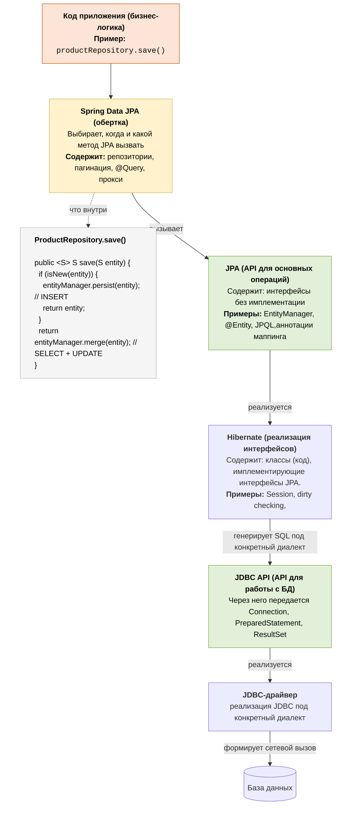

### Генерация кода Spring Data Jpa

**Spring Data JPA** - генерирует код-обертку DAO, которая проводит все необходимые проверки и вызывает необходимые стандартные методы JPA.
Код генерируется не на этапе компилляции, а прямо в runtime:
1. Spring Boot через автоконфигурацию включает `@EnableJpaRepositories`.
2. Spring Data сканирует пакеты и находит все интерфейсы, наследующие Repository (JpaRepository, CrudRepository, ...).
3. Для каждого репозитория регистрируется фабрика бинов.
4. Когда нужен бин ProductRepository, фабрика через собирает JDK dynamic proxy, который реализует твой интерфейс.
5. Этот прокси и становится бином, который инжектируется в сервисы как ProductRepository.
#### Роль прокси
В интерфейсе методы могут быть разного происхождения без единой реализации
```java
public interface ProductRepository extends JpaRepository<Product, Long> {
    // 1) CRUD — реализованы в SimpleJpaRepository
    //    (save, findById, findAll, delete...)

    // 2) derived query — НИКЕМ не реализован, его надо построить в runtime из имени
    List<Product> findByNameAndQuantityGreaterThan(String name, int qty);

    // 3) @Query — текст запроса задан вручную
    @Query("select p from Product p where p.price > :min")
    List<Product> findExpensive(@Param("min") BigDecimal min);

    // 4) default-метод — реализован прямо в интерфейсе
    default boolean isEmptyCatalog() { return count() == 0; }
}
```
Функции прокси:
1. **Диспетчеризация**: на каждый вызов метода он смотрит, к какой категории тот относится, и направляет в нужный обработчик:
	- CRUD-методы делегирует «настоящему» объекту-реализации — ProductJpaRepository (так называемый target прокси)
	- Derived-методы перехватываются специальным interceptor'ом (QueryExecutorMethodInterceptor), который парсит имя и строит запрос.
	- @Query — берётся готовый текст.
	- default-методы — вызывается реализация прямо из интерфейса.
2. **Единообразие ошибок**: конвертирует низкоуровневые исключения JDBC/Hibernate в DataAccessException
3. **Работа с транзакциями**: 
	- CRUD-методы ПОМЕЧАЮТСЯ как @Transactional
	- derived-методы НЕ ПОМЕЧАЮТСЯ как @Transactional, необходимо самостоятельно повесить эту аннотацию на метод сервиса, который вызывает derived-метод, где необходимо 

---
# 1. Persistence Context и жизненный цикл entity

**Persistence Context (PC)** — это «область памяти» внутри `EntityManager`/`Session`, где живут *управляемые* (managed) сущности на время транзакции. Ключевые свойства PC:
- **Identity map (кэш 1-го уровня)** — на один id одной сущности в рамках PC всегда один и тот же Java-объект.
- **Dirty checking** — PC сам отслеживает изменения managed-сущностей и генерирует UPDATE.
- **Write-behind** — SQL откладывается и выполняется пачкой при flush, а не на каждый сеттер.

## EntityManager, Session и откуда берётся PC

PC не висит в воздухе — он живёт внутри `EntityManager`. А `EntityManager` кем-то создаётся. Полная иерархия:

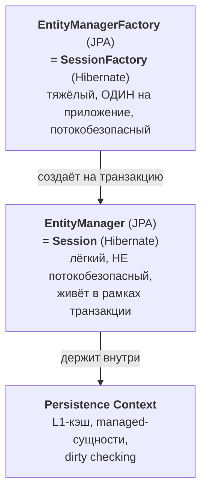

**`EntityManager` vs `Session` — это интерфейс и его реализация:**

```
EntityManager : Session  ==  List : ArrayList  ==  JPA : Hibernate
   интерфейс     реализация    интерфейс реализация   стандарт   вендор
```

- **`EntityManager`** — интерфейс-стандарт из JPA. Твой главный инструмент для работы с сущностями: `persist` / `find` / `merge` / `remove` / `createQuery` / `flush` / `detach`. По сути «пульт управления» persistence context (аналог `Connection` в JDBC, но для объектов).
- **`Session`** — реализация этого интерфейса в Hibernate (`Session extends EntityManager`), плюс собственные методы, которых нет в стандарте (`saveOrUpdate()`, `get()`/`load()`, statelessSession и т.д.). Hibernate появился раньше JPA, `Session` — его исторически родное API.

Когда в Spring ты держишь `EntityManager em`, в рантайме под ним — хибернейтовская `Session`. Это один объект, просто «через стандартные очки JPA». Нужна хибернейт-специфика — снимаешь очки:

```java
Session session = em.unwrap(Session.class);
```

| | `EntityManager` / `EntityManagerFactory` (JPA) | `Session` / `SessionFactory` (Hibernate) |
| --- | --- | --- |
| Что это | интерфейс-стандарт | реализация + расширение |
| Переносимость | можно сменить вендора (EclipseLink, OpenJPA) | привязка к Hibernate |
| Доп. методы | только стандарт | `saveOrUpdate`, `get`/`load` и др. |

> **Связь с жизнью PC:** persistence context живёт ровно столько, сколько живёт его `EntityManager`/`Session`. Новый `EntityManager` (в Spring — новая транзакция) → новый PC → свой изолированный L1-кэш. Поэтому одна и та же строка, загруженная в двух разных сессиях, — это **два разных Java-объекта** (identity гарантируется только внутри одного PC).
> **Почему `@PersistenceContext`, а не `@Autowired`:** `EntityManager` не потокобезопасен, а бины — синглтоны. `@PersistenceContext` внедряет не сам `EntityManager`, а **shared-прокси**, который на каждый вызов находит `EntityManager` текущей транзакции (через `ThreadLocal`) — поэтому один прокси безопасен в многопоточке.

## Четыре состояния сущности

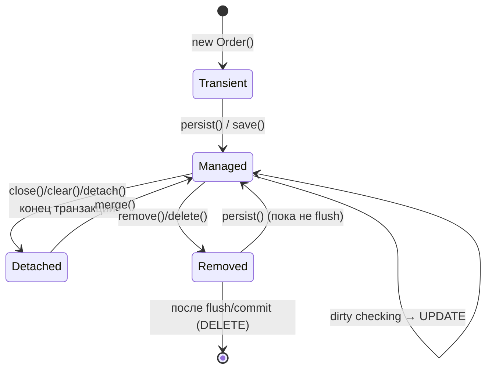

| Состояние     | Что значит                                         | Отслеживается PC? | Есть в БД?               |
| ------------- | -------------------------------------------------- | ----------------- | ------------------------ |
| **Transient** | Только что создан через `new`, ещё не связан с PC  | Нет               | Нет                      |
| **Managed**   | Привязан к открытому PC, изменения отслеживаются   | Да                | Да (или будет при flush) |
| **Detached**  | Был managed, но PC закрыт / `detach()` / `clear()` | Нет               | Да                       |
| **Removed**   | Помечен на удаление, DELETE уйдёт при flush        | Да                | Да (пока не flush)       |

```java
Order o = new Order();          // TRANSIENT
em.persist(o);                  // → MANAGED (теперь отслеживается)
o.setStatus(Status.PAID);       // dirty checking запомнит изменение
// ... commit → flush → UPDATE orders SET status=... автоматически

// после закрытия транзакции:
o.setComment("late");           // DETACHED — изменение НЕ попадёт в БД
Order merged = em.merge(o);     // вернётся НОВЫЙ managed-объект, o останется detached
```

## Dirty checking — как UPDATE происходит без `save()`

При загрузке managed-сущности Hibernate снимает **snapshot** (копию всех полей). При flush он сравнивает текущее состояние со snapshot и для изменённых полей генерирует UPDATE.

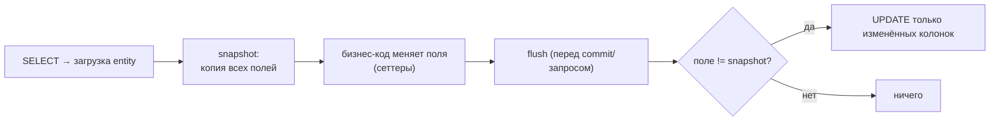

> **Вывод для собеса:** managed-сущности обновлять `repository.save()` не обязательно — достаточно изменить поле внутри транзакции, dirty checking сделает UPDATE сам. `save()` нужен для новых или detached-объектов.
> **Цена:** snapshot держит копию каждого поля каждой загруженной сущности — много managed-сущностей = память + время на сравнение при flush.

## `merge` vs `persist`

| | `persist(e)` | `merge(e)` |
| --- | --- | --- |
| Для какого состояния | transient | detached (или transient) |
| Что возвращает | `void`, сам `e` становится managed | **новый** managed-объект; переданный `e` остаётся detached |
| SQL | INSERT | SELECT (загрузить текущее) + UPDATE |

```java
// ВАЖНО: merge возвращает другой инстанс!
Order managed = em.merge(detachedOrder);
managed.setStatus(...);     // ✅ изменится
detachedOrder.setStatus(); // ❌ это detached, не отслеживается
```

## flush vs commit и FlushMode

- **`flush()`** — синхронизировать PC с БД: сгенерировать и отправить накопленный SQL. Происходит **внутри транзакции**, всё ещё можно откатить.
- **`commit()`** — зафиксировать транзакцию (commit неявно сначала делает flush).

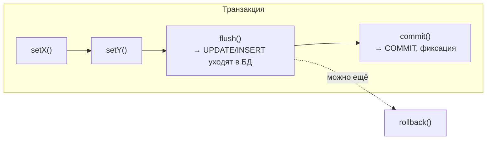

**Когда Hibernate делает flush сам** (`FlushModeType.AUTO`, по умолчанию):
1. Перед `commit()`.
2. Перед выполнением JPQL/Criteria-запроса, который может затронуть несинхронизированные изменения — чтобы запрос увидел свежие данные.

`FlushModeType.COMMIT` — flush только перед commit (запросы могут не увидеть изменения в памяти). Ручной `flush()` зовут, чтобы заранее получить сгенерированный id или поймать нарушение constraint раньше.

---

# 2. Кэш первого и второго уровня

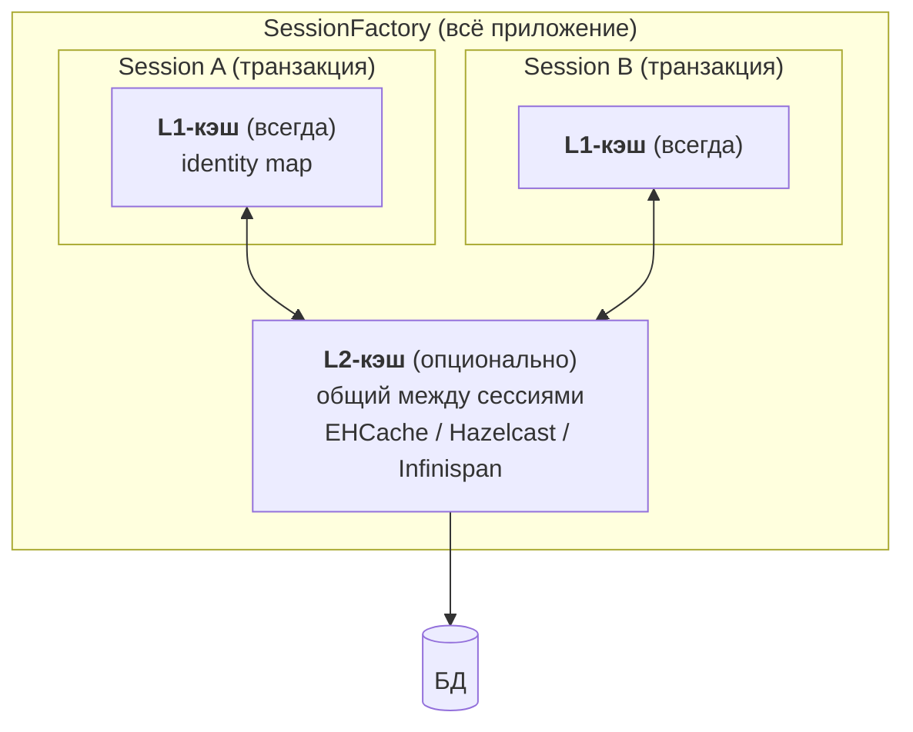

| | Кэш 1-го уровня (L1) | Кэш 2-го уровня (L2) |
| --- | --- | --- |
| Включён | **всегда**, отключить нельзя | опционально, нужен провайдер + `@Cacheable` |
| Scope (жизнь) | один PC / одна транзакция | весь `SessionFactory` (между транзакциями) |
| Что хранит | managed-сущности текущей сессии (identity map) | сущности/коллекции/query cache между сессиями |
| Инвалидация | `clear()`, `evict()`, конец PC | при изменениях через Hibernate; **внешние изменения в БД не видит** |

> **Главная ловушка L2:** если строку поменял другой сервис **мимо Hibernate** (или нативным SQL), L2 об этом не узнает → отдаст **stale**-данные. Поэтому L2 хорош для редко меняющихся справочников и плох для часто обновляемых данных.
> **Query cache** кэширует не сами сущности, а список их id по запросу; требует отдельного включения и зависит от «timestamp» таблиц — легко получить лишние инвалидации.

---

# 3. Загрузка ассоциаций: Lazy, N+1 и способы fetch

См. также отдельную заметку: [[Lazy vs Eager и LazyInitializationException]].

## Lazy vs Eager — дефолты

| Аннотация       | Fetch по умолчанию |
| --------------- | ------------------ |
| `@ManyToOne`    | **EAGER**          |
| `@OneToOne`     | **EAGER**          |
| `@OneToMany`    | **LAZY**           |
| `@ManyToMany`   | **LAZY**           |

- **Lazy** — связь грузится при первом обращении; до этого поле — это **proxy-заглушка**, а не `null`.
- **Eager** — связь грузится сразу с родителем.

`LazyInitializationException` возникает при обращении к lazy-связи **после закрытия PC** (например, в контроллере/сериализаторе вне транзакции). Правильные решения — `join fetch` / `@EntityGraph` / DTO-проекция / `Hibernate.initialize` внутри транзакции (подробно в отдельной заметке).

## Проблема N+1

Загрузили N родителей одним запросом → при обращении к lazy-связи каждого летит ещё по запросу = **1 + N**.

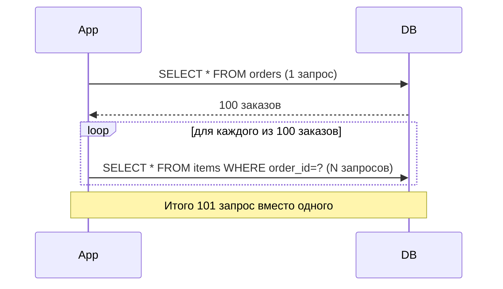

**Как обнаружить:** `spring.jpa.show-sql=true` / `logging.level.org.hibernate.SQL=DEBUG`, p6spy/datasource-proxy, Hibernate Statistics, либо assert на число запросов в тесте.

**Как лечить — три способа и их разница:**

| Способ | Что делает | Плюсы | Минусы |
| --- | --- | --- | --- |
| `JOIN FETCH` / `@EntityGraph` | один SQL с `LEFT JOIN` | 1 запрос | дубли строк; **картезиан** при 2+ коллекциях; ломает пагинацию |
| `@BatchSize` / `default_batch_fetch_size` | подгрузка пачками `WHERE id IN (...)` | дружит с пагинацией, без картезиана | не 1 запрос, а несколько |
| DTO-проекция | сразу `SELECT new Dto(...)` | тащит только нужное | нет управляемых сущностей |

```java
// join fetch — одним запросом
@Query("SELECT o FROM Order o JOIN FETCH o.items WHERE o.id = :id")
Optional<Order> findByIdWithItems(@Param("id") Long id);

// batch fetch — настройка на сущность
@OneToMany @BatchSize(size = 50) private List<Item> items;
// или глобально: hibernate.default_batch_fetch_size=50
```

## `List` (bag) vs `Set`, MultipleBagFetchException и пагинация

- `@OneToMany List` без `@OrderColumn` = **bag**: нет гарантии порядка, допускает дубли.
- `@OneToMany Set` = без дублей.

**`MultipleBagFetchException`** — при попытке `join fetch` **двух** коллекций-`List` одновременно. Hibernate не может корректно «расклеить» декартово произведение двух мешков.

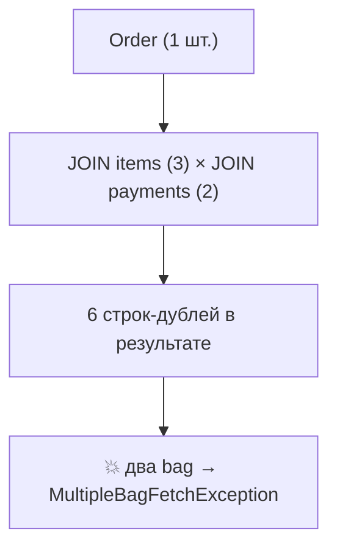

**Решения:** сделать коллекции `Set`; либо грузить по одной (`@EntityGraph`/batch); либо `Hibernate.initialize`.

**Fetch + пагинация (`Pageable`) → `HHH000104`:**

```
firstResult/maxResults specified with collection fetch; applying in memory
```

Причина: из-за `JOIN` родители дублируются в результате, поэтому Hibernate **не может** применить `LIMIT/OFFSET` в SQL — он тянет **всё** в память и режет страницу там → риск OOM на больших объёмах.

**Правильная пагинация с коллекцией — два шага:**
```java
// 1) страница ТОЛЬКО id (без fetch — limit/offset работают в SQL)
Page<Long> ids = repo.findOrderIds(pageable);
// 2) подгрузка по этим id с fetch (без пагинации)
List<Order> orders = repo.findWithItemsByIdIn(ids.getContent());
```

## `@EntityGraph` vs `join fetch`

`@EntityGraph` — декларативно указать, *что подгрузить*, поверх любого метода репозитория (включая derived и пагинацию), **без написания JPQL**.

```java
@EntityGraph(attributePaths = {"items", "customer"})
List<Order> findByStatus(Status status);   // derived-метод + жадная подгрузка
```

- **fetch graph** — перечисленные атрибуты EAGER, **все остальные — LAZY** (игнорируя их аннотации).
- **load graph** — перечисленные EAGER, остальные — по своим аннотациям (`@ManyToOne` останется EAGER).

> Преимущество над ручным `join fetch`: один derived-метод переиспользуется с разными наборами подгрузок, не плодя десяток JPQL-методов. Под капотом — тот же `LEFT JOIN`.

---

# 4. Репозитории Spring Data JPA

## Откуда берётся реализация интерфейса

Ты пишешь только интерфейс — Spring на старте создаёт **JDK dynamic proxy**, за CRUD которого стоит `SimpleJpaRepository`.

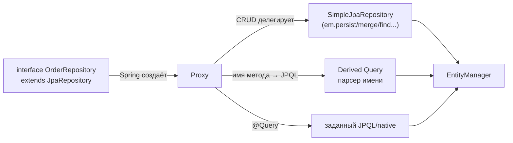

## Derived query methods

Имя метода парсится в запрос по префиксам и ключевым словам:

```java
List<User> findByEmailAndStatus(String email, Status s);
long       countByStatus(Status s);
boolean    existsByEmail(String email);
List<User> findByAgeGreaterThanOrderByNameAsc(int age);
```

Префиксы: `findBy / readBy / getBy / countBy / existsBy / deleteBy`. Ключевые слова: `And, Or, Between, LessThan, GreaterThan, Like, In, IsNull, OrderBy, Top, First`.

> Если derived-метод вернёт несколько строк, а тип возвращаемого значения единичный — `NonUniqueResultException`.

## `@Query`, JPQL vs native, `@Modifying`

```java
@Query("SELECT u FROM User u WHERE u.email = :e")      // JPQL
User findByEmailJpql(@Param("e") String email);

@Query(value = "SELECT * FROM users WHERE email = ?1",
       nativeQuery = true)                              // native SQL
User findByEmailNative(String email);

@Modifying(clearAutomatically = true)                   // обязателен для UPDATE/DELETE
@Query("UPDATE User u SET u.active = false WHERE u.lastLogin < :d")
int deactivateStale(@Param("d") LocalDate d);
```

- `@Query` — когда имя метода становится громоздким или нужен сложный запрос.
- **native** — фичи конкретной СУБД; минус — привязка к диалекту, нет автоматического маппинга/кэширования как у JPQL.
- **`@Modifying`** обязателен для update/delete `@Query` (иначе Spring ждёт SELECT).

> **Ловушка bulk-update:** `@Modifying`-запрос идёт **напрямую в БД, минуя PC (L1)**. Сущности в текущем PC останутся со старыми значениями → нужен `clearAutomatically = true` / `flushAutomatically = true`, иначе после bulk-update прочитаешь устаревшие данные из L1.

## Что реально делает `repository.save()`

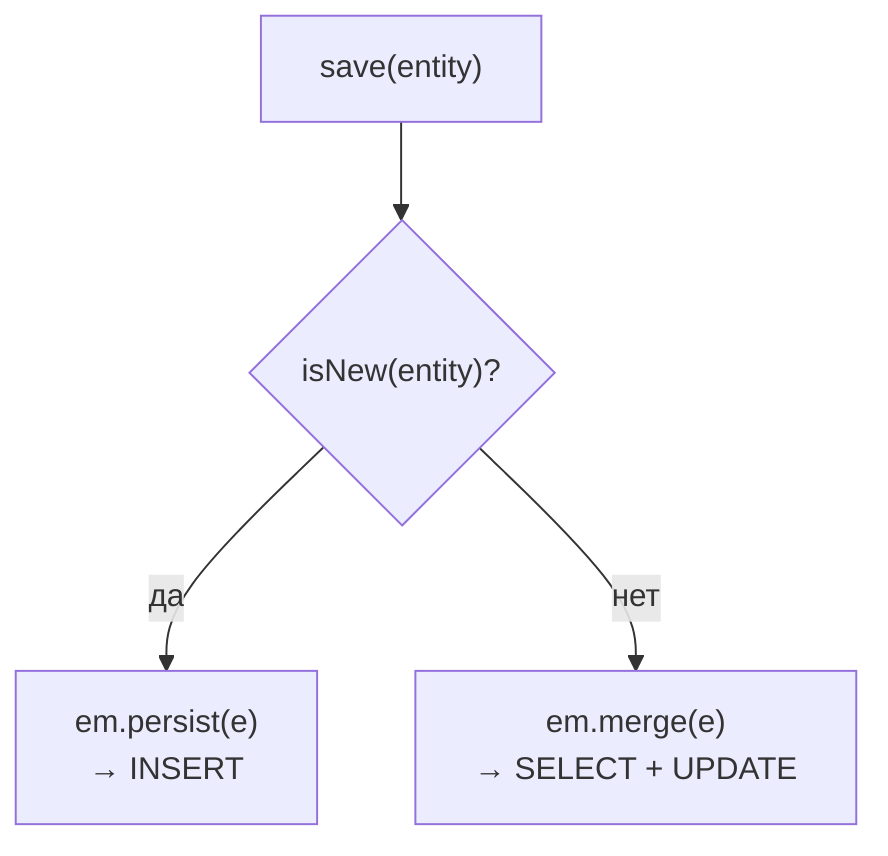

`SimpleJpaRepository.save()`:
- `isNew(entity)` истинно → `em.persist` (чистый INSERT);
- иначе → `em.merge` (а merge делает **SELECT** перед UPDATE).

**Как определяется `isNew` по умолчанию:** id `== null` (или `@Version`-поле null, или реализован `Persistable`).

**Проблема «лишнего SELECT»:** если id задаётся **вручную** (assigned id, например UUID, сгенерированный в приложении), то `id != null` → save идёт в `merge` → merge делает SELECT, чтобы загрузить текущее состояние перед слиянием. На пустой таблице это лишний запрос перед каждым INSERT.

**Как убрать:**
```java
@Entity
class Order implements Persistable<UUID> {
    @Id private UUID id = UUID.randomUUID();
    @Transient private boolean isNew = true;   // флаг новизны

    @Override public UUID getId() { return id; }
    @Override public boolean isNew() { return isNew; }

    @PostPersist @PostLoad
    void markNotNew() { this.isNew = false; }   // после INSERT/SELECT — уже не новая
}
```
Альтернативы: использовать `@Version`, или звать `em.persist` напрямую для заведомо новых.

---

# 5. Cascade и orphanRemoval

**Cascade** распространяет операцию с родителя на детей.

| Тип | Что каскадирует |
| --- | --- |
| `PERSIST` | сохранить детей при сохранении родителя |
| `MERGE` | слить детей при merge родителя |
| `REMOVE` | удалить детей при удалении **родителя** |
| `REFRESH`, `DETACH` | соответствующие операции |
| `ALL` | все перечисленные |

**`orphanRemoval = true`** — удалить ребёнка, когда его **убрали из коллекции** родителя (разорвали связь), даже без удаления самого родителя.

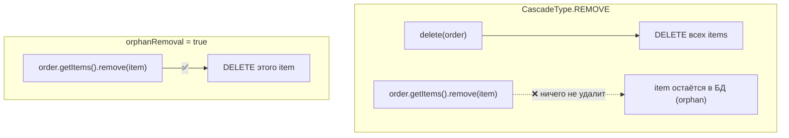

```java
@OneToMany(mappedBy = "order",
           cascade = CascadeType.ALL,
           orphanRemoval = true)
private List<Item> items = new ArrayList<>();

order.getItems().remove(item);   // с orphanRemoval → DELETE item
                                 // без него → останется «висячая» строка
```

> **Разница на примере:** строка заказа без заказа не нужна. Убрал позицию из заказа → она должна удалиться (это `orphanRemoval`). `CascadeType.REMOVE` срабатывает только при удалении самого заказа, а при `remove()` из коллекции — нет.
> **Опасность:** `CascadeType.REMOVE`/`ALL` на `@ManyToMany` может каскадно удалить «чужие» связанные сущности — почти всегда не то, что нужно.

---

# 6. Блокировки: оптимистичная и пессимистичная

## Оптимистичная (`@Version`)

«Конфликты редки» — не блокируем, а проверяем версию при записи.

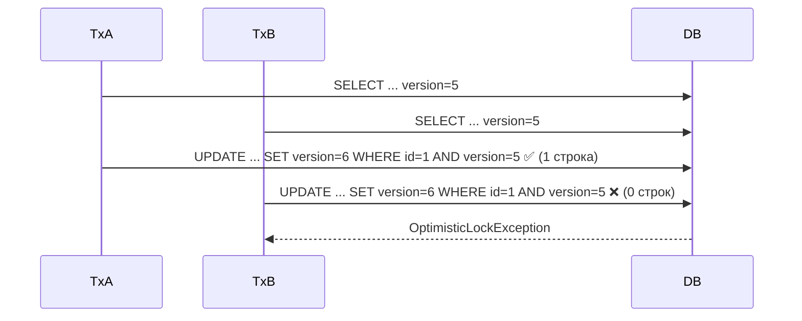

```java
@Entity
class Account {
    @Id Long id;
    @Version int version;   // Hibernate сам инкрементит при UPDATE
    BigDecimal balance;
}
```

При UPDATE добавляется `WHERE version = ?`. Если обновлено 0 строк → кто-то уже поменял → `OptimisticLockException` / `ObjectOptimisticLockingFailureException`.

**Обработка конфликта** — перечитать свежую сущность и **повторить** (retry), либо показать пользователю «данные устарели».

## Пессимистичная

«Конфликты часты» — блокируем строку в БД на время транзакции.

```java
@Lock(LockModeType.PESSIMISTIC_WRITE)   // SELECT ... FOR UPDATE
@Query("SELECT a FROM Account a WHERE a.id = :id")
Account findForUpdate(@Param("id") Long id);
```

- `PESSIMISTIC_WRITE` → `SELECT ... FOR UPDATE`, эксклюзивная блокировка строки.
- `PESSIMISTIC_READ` → разделяемая (shared) блокировка.

| | Оптимистичная (`@Version`) | Пессимистичная (`FOR UPDATE`) |
| --- | --- | --- |
| Блокирует строку | нет | да, до конца транзакции |
| Когда выбрать | мало конфликтов, длинные/web-транзакции | высокая конкуренция за конкретные строки, короткие транзакции |
| Риск | потеря работы на ретрае | блокировки, таймауты, deadlock под нагрузкой |

---

# 7. Транзакции `@Transactional`

## Где ставить `@Transactional`: границы транзакций

**Репозиторий транзакционен per-method.** `@Transactional` висит на классе `SimpleJpaRepository`, поэтому каждый CRUD-вызов — это **отдельная** транзакция:
- читающие CRUD (`findById`, `findAll`, `count`) → `@Transactional(readOnly = true)`;
- пишущие CRUD (`save`, `delete`) → обычный `@Transactional`;
- **derived-методы** (`findByName...`) и **`@Query`** — своей `@Transactional` НЕ имеют.

Из этого следует главное правило: **границу транзакции задавай на сервисном слое**, т.к. бизнес-операция (а не отдельный запрос) — это логическая единица работы. Иначе два вызова репозитория = две независимые транзакции:

```java
// БЕЗ @Transactional на сервисе — ДВЕ транзакции, не атомарно:
public void transfer(...) {
    accountRepo.save(debit);   // транзакция №1 (закоммитилась)
    accountRepo.save(credit);  // транзакция №2 — упадём между ними → деньги списаны, но не зачислены ❌
}

// С @Transactional — ОДНА транзакция на обе операции:
@Transactional
public void transfer(...) {
    accountRepo.save(debit);
    accountRepo.save(credit);  // репозиторный @Transactional присоединится (REQUIRED), новую не откроет
}
```

**Когда `@Transactional` НА СЕРВИСЕ нужен / не нужен:**

| Сценарий | Нужен `@Transactional`? |
| --- | --- |
| Один читающий вызов, данные используются сразу | нет (одиночный SELECT работает и в auto-commit) |
| Несколько операций, должны быть атомарны | **да** |
| Запись (одна или несколько) | **да** |
| После запроса обращаешься к **lazy**-связям | **да** (иначе `LazyInitializationException` — PC закрыт, OSIV off) |
| Несколько чтений, нужен согласованный снимок | **да** (`readOnly = true`) |
| Изменяющий `@Query` | **да** + `@Modifying` (иначе `TransactionRequiredException`) |

**Конвенция (рекомендуемая практика):**

```java
@Service
public class ProductService {

    @Transactional(readOnly = true)     // на ВСЕ читающие сервисные методы
    public List<Product> search(String name) { return repo.findByNameContaining(name); }

    @Transactional                       // на ВСЕ пишущие/составные
    public Product create(Product p) { return repo.save(p); }
}
```

> `readOnly = true` на чтении — не косметика: Hibernate ставит `FlushMode = MANUAL` (нет dirty checking и лишних flush), плюс возможна маршрутизация на read-реплику. На пишущих — обычный `@Transactional`.
> **Вывод:** не «вешать `@Transactional` на каждый чих», а проводить границу по бизнес-операции. Один сервисный метод = одна логическая единица работы = одна транзакция; репозиторные транзакции присоединяются к ней (REQUIRED).

## Propagation: REQUIRED / REQUIRES_NEW / NESTED

```mermaid
flowchart TB
    subgraph REQ["REQUIRED (дефолт)"]
        A1["outer()"] --> A2["inner() — та же транзакция"]
        A2 -->|"исключение"| A3["откатывается ВСЁ"]
    end
    subgraph RN["REQUIRES_NEW"]
        B1["outer (TX1)"] -->|"приостановлена"| B2["inner (TX2, новое соединение)"]
        B2 -->|"commit TX2 независим"| B3["TX2 сохранится даже если TX1 откатится"]
    end
    subgraph NE["NESTED"]
        C1["outer (TX)"] --> C2["savepoint"]
        C2 --> C3["inner"]
        C3 -->|"исключение"| C4["откат до savepoint, outer продолжается"]
    end
```

| Propagation | Поведение | Соединение | Откат вложенного |
| --- | --- | --- | --- |
| `REQUIRED` | присоединиться или создать | то же | марает всю транзакцию |
| `REQUIRES_NEW` | приостановить текущую, открыть новую | **новое** | независим от внешней |
| `NESTED` | savepoint внутри текущей | то же + savepoint | откат до savepoint, внешняя живёт |

> **Применение `REQUIRES_NEW`:** аудит/лог, который должен сохраниться, **даже если основная операция откатится**.
> **Риск `REQUIRES_NEW`:** при удержании блокировок внешней транзакцией можно получить самоблокировку и исчерпание пула соединений (две транзакции одновременно).

## rollbackFor — на чём откатывается

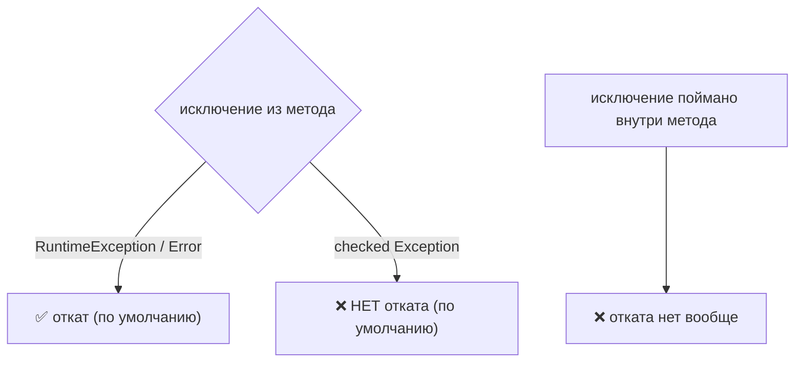

- По умолчанию откат **только** на `RuntimeException` и `Error` (unchecked). Checked-исключения **не** откатывают — наследие EJB-семантики («checked = ожидаемая бизнес-ситуация»).
- Откатываться на checked: `@Transactional(rollbackFor = Exception.class)`.
- `noRollbackFor` — наоборот, не откатывать на указанных.

```java
@Transactional(rollbackFor = IOException.class)
public void importFile() throws IOException { ... }
```

> **Главная ловушка:** откат привязан к выходу исключения **из проксированного метода**. Поймал исключение внутри (`try/catch` и проглотил) → отката не будет. Нужно — пробросить дальше или вручную `TransactionAspectSupport.currentTransactionStatus().setRollbackOnly()`.

## Бонус: почему `@Transactional` иногда «не работает»

Spring оборачивает бин **прокси**. Аннотация срабатывает только при вызове **через прокси** (извне).

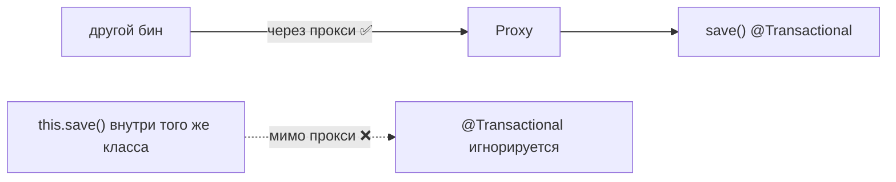

Не работает при:
- **self-invocation** — вызов `this.save()` из другого метода того же класса (минует прокси);
- **`private`/`final`-методах** — прокси не может их перехватить.

Решения: вынести метод в другой бин, self-inject, или `TransactionTemplate`.

---

# Шпаргалка-резюме (что сказать на собесе одной фразой)

- **Состояния:** transient → `persist` → managed (dirty checking) → `clear`/конец TX → detached → `merge` → managed. UPDATE managed-сущности идёт сам через snapshot.
- **N+1:** 1+N запросов; лечится `join fetch`/`@EntityGraph` (1 запрос, но картезиан) или batch fetch (IN-пачки, дружит с пагинацией).
- **MultipleBagFetch:** два `List` в одном fetch; делай `Set` или грузи по одному. Fetch+Pageable → `HHH000104`, режет в памяти → пагинируй id двумя шагами.
- **save():** `isNew` → persist, иначе merge (SELECT+UPDATE). Assigned id → лишний SELECT, чинится `Persistable.isNew()`.
- **L1** всегда (scope = транзакция, identity map), **L2** опционален (scope = SessionFactory, риск stale при внешних изменениях).
- **@Version** — оптимистичная (ретрай при конфликте), `FOR UPDATE` — пессимистичная (блокировка строки).
- **Propagation:** REQUIRED (одна TX), REQUIRES_NEW (новое соединение, независимый commit), NESTED (savepoint).
- **rollbackFor:** по умолчанию откат только на unchecked; пойманное исключение отката не вызовет.
- **@Transactional** работает только через прокси: не сработает на self-invocation/private.


TODO:
Но есть реальные сценарии, где спускаешься на уровень EntityManager напрямую:

┌────────────────────────────────────────┬─────────────────────────────────────────────────────────┐
│       Когда нужен EntityManager        │                          Зачем                          │
├────────────────────────────────────────┼─────────────────────────────────────────────────────────┤
│ Кастомная реализация репозитория       │ сложные динамические запросы через Criteria API         │
│ (...RepositoryImpl)                    │                                                         │
├────────────────────────────────────────┼─────────────────────────────────────────────────────────┤
│ Батч-обработка больших объёмов         │ em.flush() + em.clear() каждые N записей, чтобы L1-кэш  │
│                                        │ не разрастался и не было OOM                            │
├────────────────────────────────────────┼─────────────────────────────────────────────────────────┤
│ Точный контроль состояния              │ em.detach(), em.refresh(), em.merge() вручную           │
├────────────────────────────────────────┼─────────────────────────────────────────────────────────┤
│ Нативные/сложные запросы               │ em.createQuery / createNativeQuery, getReference()      │
│                                        │ (ленивая ссылка без SELECT)                             │
└────────────────────────────────────────┴─────────────────────────────────────────────────────────┘