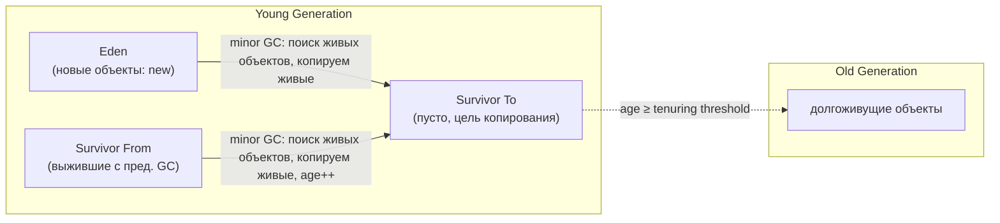
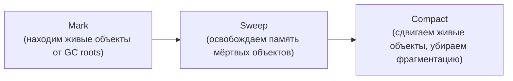
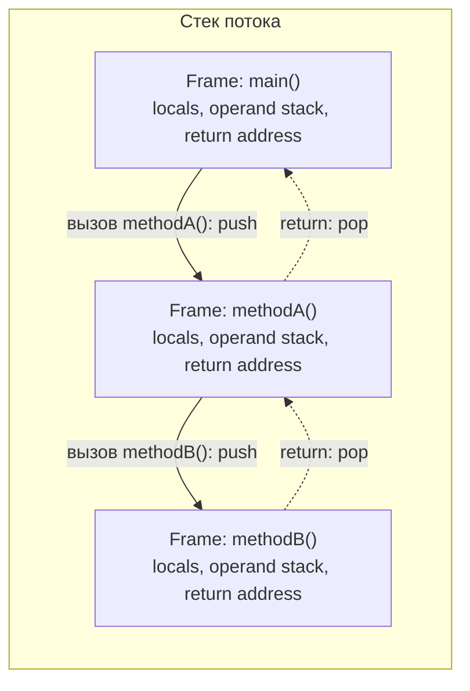

# Структура памяти JVM
## Heap - общая память для объектов

#### **Поиск GC живых и неживых объектов**
Идея: GC ищет живые (те, которые будут скопированы в область памяти для следующей проверки) объекты и неживые (те, которые будут перезаписаны другими - "живыми" объектами).

Пометить на копирование - обозначить, что объект не должен быть удален (перезаписан)

Алгоритм проверки:
1. **Операция Stop The World** - все потоки одновременно приостанавливаются в **safepoint** - точке, где состояние потока однозначно известно и недоступно для GC. Потоки не продолжат работу, пока GC не разрешит.
2. Запускается пул из GC-worker-потоков, которые параллельно начинают сканировать все потоки приложения (main в том числе)
3. Для каждого потока извлекается его стек вызовов. Внутри каждого фрейма из стека вызовов берутся все локальные переменные, которые являются объектами - помечаются на копирование
4. Для каждого найденного объекта происходит рекурсивный обход по всем его полям, если ссылка на поле присутствует, то объект помечается на копирование
5. К ссылкам выше отдельно добавляются static-поля
6. Добавляется карта из JIT-компиллятора, который содержит живые ссылки, т.к. они фактически были вызваны

### Heap состоит из следующих компонентов:
#### **Young Generation**
**Young Generation** - область для свежесозданных или короткоживущих объектов. Цикл garbage collection запускается **часто и быстро** (minor gc), потому что большая часть объектов в ней умирает молодыми.

- Eden - область для новых (созданных через new) объектов.
- Survivor From - область для объектов, которые пережили предыдущий цикл garbage collection
- Survivor To - область, куда копируются объекты для прохождения текущего цикла garbage collection
> После цикла `From` и `To` меняются ролями: то, что было `To`, становится `From` для следующего minor GC.

**age** - для новых объектов в Eden = 0. age инкрементируется при копировании живого объекта в Survivor To область. Максимальный age = 15 (связано с размером ячейки переменной в метаинформации)

**tenuring threshold** - динамически изменяемое значение, адаптируется в рамках minor GC. Сделан в угоду баланса между "не переполнять Survivor To" и "не очищать слишком рано"

**minor GC** - цикл сборки мусора для Young Generation:
1. Копирование Eden и Survivor From в Survivor To, для каждого объекта увеличивается его age.
2. Очистка Eden и Survivor From
#### **Old Generation**
**Old Generation** - область для долгоживущих объектов, перешедших из Young Generation после нескольких minor gc (когда age объекта достиг tenuring threshold). Цикл garbage collection **запускается реже, но дороже** (major/full gc), потому что область больше и в ней преобладают живые объекты.

**major/full GC** - цикл сборки мусора для Old Generation (mark-sweep-compact):
1. Mark: находим все живые объекты, достижимые от GC roots
2. Sweep: память мёртвых объектов, освобождается
3. Compact: живые объекты сдвигаются вместе, чтобы убрать фрагментацию
## Metaspace
Метаданные классов (структуры классов, методы, constant pool). Растёт динамически, ограничен `-XX:MaxMetaspaceSize`
## Стек
Область памяти, которая только связана с потоками, выделяется при создании потока. У каждого потока свой стек.

Что **ХРАНИТСЯ** в стеке (только примитивные значения и указатели):
1. Локальные переменные и параметры метода.
	- примитивы (хранение по значению)
	- ссылки на области heap (для массивов и объектов)
2. Мета-информация о фреймах

Что **НЕ ХРАНИТСЯ** в стеке: значение объектов, поля объектов, значения массивов, поля объектов

**Очистка стека**: garbage collector работает только с heap, стек наполняется и очищается самостоятельно. При вызове метода фрейм создается (push()), при завершении метода фрейм очищается (pop())

---
# Garbage Collector
### Виды 

Алгоритм выбора GC:
1) GC по умолчанию
	-  G1 (с Java 9)
	- Parallel GC (до Java 9)
2) Если приложение работает с большим heap(десятки–сотни ГБ+) и наблюдаются большие GC-паузы/есть жесткий SLA на GC-паузы
	 - ZGC
	 - Shenandoah (Если ZGC не предоставляется вашим JDK)
3) Если на машине малое число CPU-ядер (1–2 vCPU контейнеры) и/или совсем небольшой heap
	- Serial GC

| GC                                                                     | Механика                                                                                                             | Паузы                                                            | Целевая метрика                                                 | Когда применять                                                                                                                                                        |
| ---------------------------------------------------------------------- | -------------------------------------------------------------------------------------------------------------------- | ---------------------------------------------------------------- | --------------------------------------------------------------- | ---------------------------------------------------------------------------------------------------------------------------------------------------------------------- |
| **Serial** (`-XX:+UseSerialGC`)                                        | Один поток собирает и Young (copying), и Old (mark-sweep-compact). Всё строго STW                                    | Длинные, пропорциональны heap                                    | Минимальный overhead на маленьких heap                          | Маленькие heap (десятки–сотни МБ), 1 CPU, контейнеры с жёстким лимитом ядра — где параллельные GC-воркеры просто негде запускать                                       |
| **Parallel** / Parallel Scavenge + Parallel Old (`-XX:+UseParallelGC`) | Несколько потоков параллельно делают и Young, и Old сборку, но всё ещё полный STW (без конкурентности с приложением) | Заметные, но короче Serial за счёт параллелизма                  | Максимальный **throughput** (суммарная полезная работа / время) | Batch-обработка, офлайн-вычисления, ETL — где не важна длина отдельной паузы, важна максимальная пропускная способность на многоядерной машине. Был дефолтным в Java 8 |
| **G1** (Garbage-First) (`-XX:+UseG1GC`, дефолт с Java 9)               | Регионы, инкрементальная сборка Old по подмножеству регионов + конкурентный mark, компактифицирует при эвакуации     | Контролируемые, целятся в `-XX:MaxGCPauseMillis` (default 200мс) | Баланс throughput/latency без сложной настройки                 | **Дефолтный выбор для большинства серверных приложений** — heap от единиц до сотен ГБ, нет экстремальных требований к latency                                          |
| **ZGC** (`-XX:+UseZGC`)                                                | Полностью конкурентные mark и relocate через colored pointers + load barriers, STW только для root-сканирования      | Sub-миллисекундные, **не зависят от размера heap**               | Минимальная latency на очень больших heap                       | Терабайтные heap, жёсткие SLA по паузам (торговые системы, большие in-memory кэши). Платишь дополнительным CPU/памятью на барьеры                                      |
| **Shenandoah** (`-XX:+UseShenandoahGC`)                                | Та же идея, что у ZGC — конкурентная компактификация, но через forwarding pointers (Brooks pointers)                 | Тоже почти не зависят от размера heap                            | Низкая latency как альтернатива ZGC                             | Latency-sensitive нагрузки, особенно если ZGC недоступен на вашей версии JDK/вендоре                                                                                   |

#### Проблемы, связанные с памятью

**Типичные утечки памяти при наличии GC** (объект жив, потому что на него есть ссылка, хотя логически не нужен): статические коллекции, `ThreadLocal` в пуле потоков без очистки, незакрытые ресурсы/listener'ы. Искать через heap dump + dominators (кто держит самое большое поддерево ссылок).

**`OutOfMemoryError` разновидности:** heap space (объекты не помещаются), Metaspace (слишком много загруженных классов), GC overhead limit exceeded (GC работает почти всё время, но освобождает мало), unable to create native thread (упёрлись в лимит ОС на потоки/память процесса).

**Длинные GC-паузы** - периоды Stop The World - решается разными GC по-разному, но основная идея следующая - либо увеличивать конкурентность (например, кол-во воркеров для root-сканирования), либо изменение размеров/наполнения регионов памяти.

---
